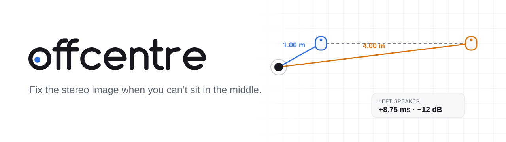
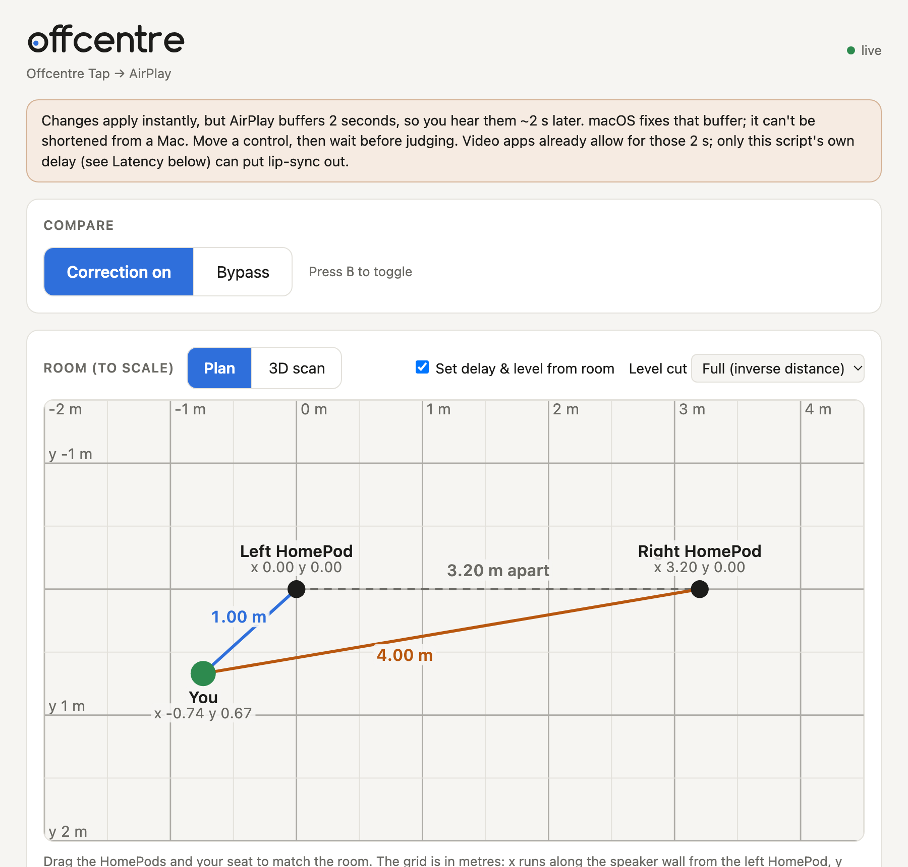

<p align="center">
  <picture>
    <source media="(prefers-color-scheme: dark)" srcset="assets/banner-dark.svg">
    
  </picture>
</p>

<p align="center">
  
  
  
  
</p>

Sit closer to one speaker and two things go wrong: its sound reaches you first and louder, and your brain pins the whole stereo image to it (the [Haas effect](https://en.wikipedia.org/wiki/Precedence_effect)). Vocals that should float between the speakers come from the near one.

**offcentre** fixes this in real time on macOS. It delays and turns down the nearer speaker by exactly the right amount, so both speakers reach your seat together and at the same level. It works with AirPlay speakers such as a HomePod stereo pair, and with any wired speakers.

<p align="center">
  <picture>
    <source media="(prefers-color-scheme: dark)" srcset="assets/screenshot-dark.png">
    
  </picture>
</p>

```
apps ──▶ Core Audio tap ──▶ offcentre ──────────────▶ system output (AirPlay / HomePods / DAC)
        (originals muted)   delay + cut the near side
```

- **Live control page** with bypass A/B, speaker solo, and per-speaker delay and level
- **To-scale room plan**: drag the speakers and your seat, or drop in a **3D phone scan** of your room and click where things are
- **Lossless-aware**: untouched channels stay bit-perfect, and the attenuated channel is dithered at the output's real bit depth
- **No virtual audio driver needed**: it uses the macOS 14.2+ system audio tap

## The maths

For a seat 1 m from the left speaker and 4 m from the right:

| | Formula | Result |
|---|---|---|
| Delay on the near side | (4 − 1) m ÷ 343 m/s | 8.746 ms = 386 samples at 44.1 kHz |
| Level on the near side | 1 m ÷ 4 m (sound pressure falls as 1/distance) | ×0.25 = −12.04 dB |

The near side is turned down rather than the far side turned up, so the output can never clip. Rounding the delay to a whole sample is off by at most 11 µs, about 4 mm of sound travel.

## Requirements

- macOS 14.2 or later (for the system audio tap)
- Xcode command line tools, to compile the small Swift helper: `xcode-select --install`

## Install

**Homebrew**

```bash
brew install vihanga-w/offcentre/offcentre
```

**pipx** (Python 3.10+)

```bash
pipx install git+https://github.com/vihanga-w/offcentre.git
```

**From source**

```bash
git clone https://github.com/vihanga-w/offcentre.git && cd offcentre
python3 -m venv .venv && .venv/bin/pip install -e .
```

## Use

1. **HomePods only:** make them a stereo pair in the Home app (HomePod → Settings → Create Stereo Pair). If they aren't paired, each one plays the full mix and no per-channel correction can work.
2. **Select your speakers as the system output** (Control Center → Sound, or System Settings → Sound → Output). Choose the speakers themselves, not a Multi-Output Device.
3. **Run it:**
   ```bash
   offcentre --near 1 --far 4 --near-side left
   ```
   Use your own distances. The control page opens at http://127.0.0.1:8765.

   The first run asks for **System Audio Recording** permission for your terminal app. Allow it under System Settings → Privacy & Security → Screen & System Audio Recording, then restart the terminal.

When offcentre stops, including if it crashes, the tap is removed and normal audio comes straight back.

## The control page

- **Compare:** correction on / bypass (<kbd>B</kbd>). Over AirPlay, give each change about 2 s to arrive.
- **Speaker check:** play left only or right only. Use it first: it confirms each speaker really gets its own channel, and that left and right aren't swapped.
- **Room (to scale):** a metre grid with the two speakers and your seat. Drag them, or type measured x/y values. With *Set delay & level from room* ticked, every move re-derives the correction. **Level cut** lets you apply less than the full inverse-distance cut, because reflections in a real room shrink the level difference, so ½ to ¾ often sounds more natural.
- **Per-speaker delay and level** for fine-tuning by ear. Moving these hands control back from the room plan.
- **Audio quality:** output format, and whether each channel is bit-perfect, dithered or muted.

Settings are saved to `~/Library/Application Support/offcentre/settings.json` and restored on the next run (`--reset` starts from the command-line distances). The page only listens on localhost and rejects cross-site requests.

### 3D room scan

1. Scan the room with a phone app that exports Gaussian splats, such as **Scaniverse** (free) in *Splat* mode. Walk slowly so both speakers and your seat are seen from several angles.
2. Export as **PLY** or **SPZ** and move the file to the Mac.
3. In **Room → 3D scan**, drop the file in. It never leaves the browser.
4. Click the left speaker, the right speaker, and where your head is when seated. Optionally enter the tape-measured speaker spacing to correct the scale. Scans from iPhones with LiDAR are usually metric already.
5. **Use these positions** copies the layout to the plan, measured along the floor.

The 3D view uses [Spark](https://sparkjs.dev) and three.js, loaded from jsDelivr the first time it opens.

## How it works

**Capture without a virtual driver.** The usual approach, setting the system output to a loopback driver such as BlackHole and reading it back, can't reach AirPlay. macOS only creates the AirPlay audio device while it is the selected system output. So the system output stays on the real speakers, and a Swift helper (`macos/system_audio_tap.swift`) uses Core Audio's process tap API to:
- capture every app except offcentre itself, so there's no feedback loop;
- mute the originals while the tap is read;
- expose the mix as an aggregate device that is clocked by the output.

**One clock, no drift.** The aggregate contains the output device, so capture and playback run as a single duplex stream. There's no buffer between them, nothing drifts, and offcentre adds only about 23 ms. AirPlay's own fixed 2 s latency is reported to apps, so video lip-sync still works.

**Lossless where possible.** AirPlay from a Mac is ALAC at 16-bit / 44.1 kHz, CD-quality lossless, and the device offers no other format. Within that:
- delays move whole samples, so a delayed or untouched channel is unaltered, and bypass is bit-identical (all three are checked by the tests);
- a level change has to requantise, so that channel gets ±1 LSB TPDF dither at the output's real bit depth;
- keep the master volume at 0 dB and use the speakers' own volume to keep the untouched channel bit-perfect.

**Click-free changes.** Settings are immutable snapshots swapped in at block boundaries, and each change is crossfaded over one block.

### Wired speakers without the tap

`--source blackhole` reads from [BlackHole](https://github.com/ExistentialAudio/BlackHole) instead, for macOS versions without the tap API. Set the system output to BlackHole 2ch and pass `--output "<your speakers>"`. This route needs Microphone permission, runs capture and playback on separate clocks with drift correction, and disables the volume keys.

## Options

```
--near 1 --far 4 --near-side left   geometry in metres (defaults shown)
--attenuation-db 6                  override the inverse-distance level cut
--volume-db -10                     extra master cut in dB
--source tap|blackhole              capture method (default tap)
--output NAME|INDEX                 output device (default: system output)
--samplerate 44100 --blocksize 512  stream settings
--port 8765 / --no-web / --no-browser   control page
--reset / --no-save                 ignore / don't write settings.json
--list-devices / --dry-run          inspect without streaming
```

## Development

```bash
.venv/bin/pip install -e ".[test]"
.venv/bin/python -m pytest -q
```

The banner, logo and social image are generated from code (`assets/brand/`), including the logotype, which is drawn from circles and lines rather than set in a font:

```bash
python3 assets/brand/build.py      # SVGs and the favicon
sh assets/brand/render.sh          # social-preview.png, via headless Chrome
```

## Licence

MIT, see [LICENSE](LICENSE). Third-party software offcentre relies on, and its licences, is listed in [THIRD_PARTY_NOTICES.md](THIRD_PARTY_NOTICES.md).
